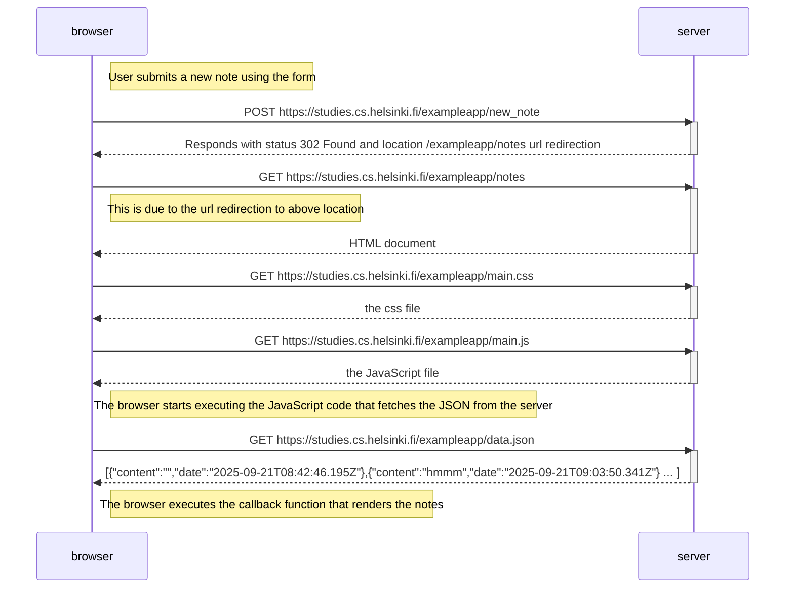

```mermaid
sequenceDiagram
    participant browser
    participant server

    Note right of browser: User submits a new note using the form
    browser->>server: POST https://studies.cs.helsinki.fi/exampleapp/new_note
    activate server
    server-->>browser: Responds with status 302 Found and location /exampleapp/notes url redirection
    deactivate server


    browser->>server: GET https://studies.cs.helsinki.fi/exampleapp/notes
    activate server
    Note right of browser: This is due to the url redirection to above location
    server-->>browser: HTML document
    deactivate server


    browser->>server: GET https://studies.cs.helsinki.fi/exampleapp/main.css
    activate server
    server-->>browser: the css file
    deactivate server

    browser->>server: GET https://studies.cs.helsinki.fi/exampleapp/main.js
    activate server
    server-->>browser: the JavaScript file
    deactivate server

    Note right of browser: The browser starts executing the JavaScript code that fetches the JSON from the server

    browser->>server: GET https://studies.cs.helsinki.fi/exampleapp/data.json
    activate server
    server-->>browser: [{"content":"","date":"2025-09-21T08:42:46.195Z"},{"content":"hmmm","date":"2025-09-21T09:03:50.341Z"} ... ]
    deactivate server

    Note right of browser: The browser executes the callback function that renders the notes
```