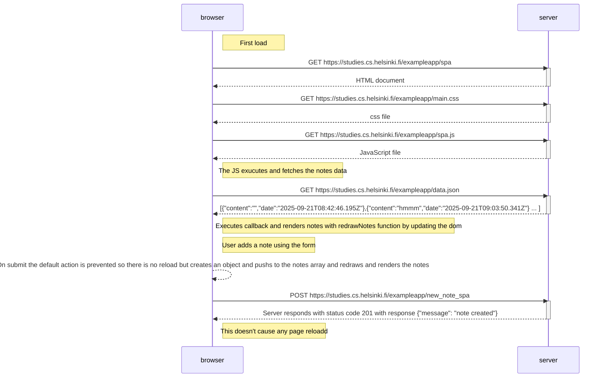

```mermaid
sequenceDiagram
    participant browser
    participant server

    Note right of browser: First load
    browser->>server: GET https://studies.cs.helsinki.fi/exampleapp/spa
    activate server
    server-->>browser: HTML document
    deactivate server

    browser->>server: GET https://studies.cs.helsinki.fi/exampleapp/main.css
    activate server
    server-->>browser: css file
    deactivate server

    browser->>server: GET https://studies.cs.helsinki.fi/exampleapp/spa.js
    activate server
    server-->>browser: JavaScript file
    deactivate server

    Note right of browser: The JS exucutes and fetches the notes data
    browser->>server: GET https://studies.cs.helsinki.fi/exampleapp/data.json
    activate server
    server-->>browser: [{"content":"","date":"2025-09-21T08:42:46.195Z"},{"content":"hmmm","date":"2025-09-21T09:03:50.341Z"} ... ]
    deactivate server

    Note right of browser: Executes callback and renders notes with redrawNotes function by updating the dom

    Note right of browser: User adds a note using the form

    browser-->>browser: On submit the default action is prevented so there is no reload but creates an object and pushs to the notes array and redraws and renders the notes
    browser->>server: POST https://studies.cs.helsinki.fi/exampleapp/new_note_spa
    activate server
    server-->>browser: Server responds with status code 201 with response {"message": "note created"}
    deactivate server
    Note right of browser: This doesn't cause any page reloadd

```